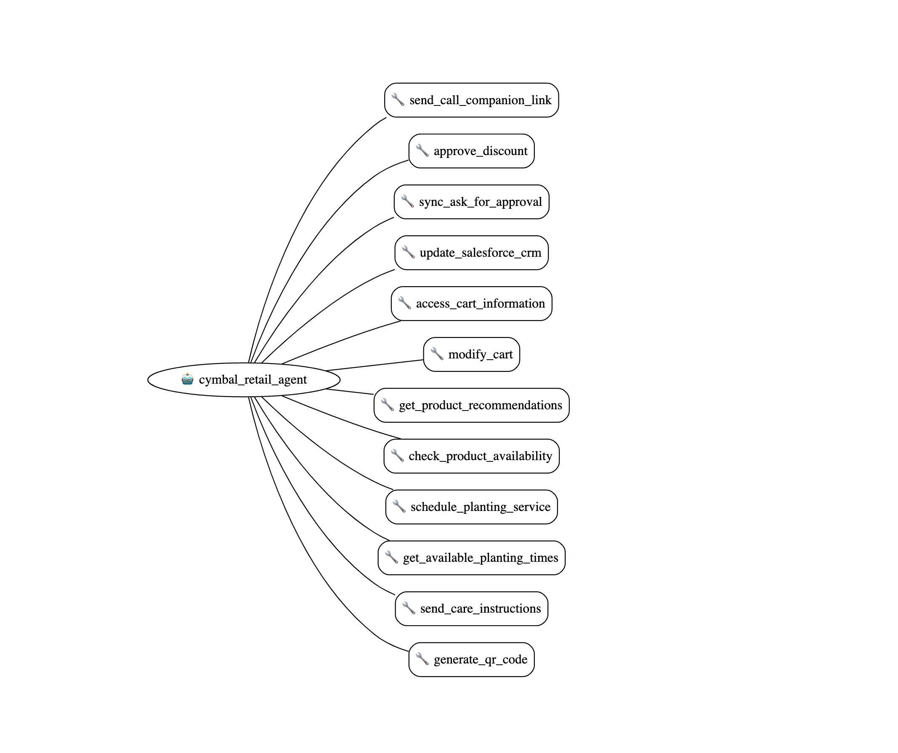
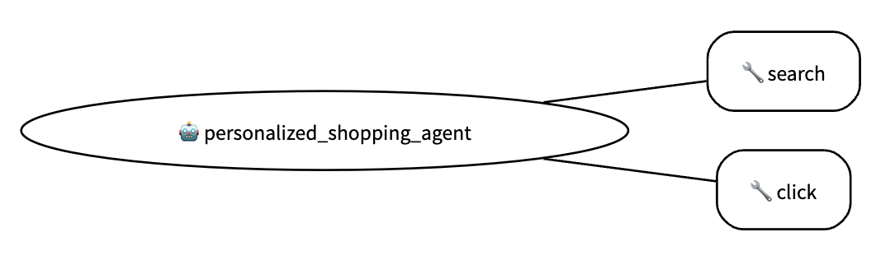

# Google ADK Samples

This repository contains a collection of production-ready sample agents built using the [Google Agent Development Kit (ADK)](https://github.com/google/adk-python). Each sample demonstrates different capabilities and integration patterns for building sophisticated AI agents.

## Sample Agents

| Agent | Description | Key Features | Architecture |
|-------|-------------|--------------|--------------|
| [Brand Search Optimization](agents/brand-search-optimization) | Analyzes and optimizes product data using search patterns | • Web scraping<br>• BigQuery integration<br>• Multi-agent coordination |  |
| [Customer Service](agents/customer-service) | Retail customer service assistant with human handoff | • Tool integration<br>• Multimodal support<br>• Live interaction |  |
| [Data Science](agents/data-science) | Advanced data analysis with specialized agent roles | • Custom tools<br>• Agent collaboration<br>• RAG capabilities |  |
| [FOMC Research](agents/fomc-research) | Financial market event analysis and reporting | • Video analysis<br>• Time series data<br>• Report generation |  |
| [LLM Auditor](agents/llm-auditor) | Verifies and audits LLM responses | • Content verification<br>• Response auditing<br>• Quality assurance |  |
| [Personalized Shopping](agents/personalized-shopping) | E-commerce recommendation agent | • User profiling<br>• Product matching<br>• Web environment |  |
| [RAG](agents/RAG) | Document retrieval and Q&A system | • Vector search<br>• Context management<br>• Query optimization |  |
| [Travel Concierge](agents/travel-concierge) | Travel planning and booking assistant | • Custom tools<br>• Session memory<br>• Multi-step planning |  |

## Prerequisites

- Python 3.9 or higher
- [Poetry](https://python-poetry.org/docs/#installation) for dependency management
- Google Cloud account with Vertex AI access
- [Google ADK](https://google.github.io/adk-docs/get-started/quickstart/) installed and configured

## Getting Started

1. Clone this repository:
```bash
git clone https://github.com/google/adk-samples.git
cd adk-samples
```

2. Choose an agent to work with:
```bash
cd agents/<agent-name>
```

3. Install dependencies:
```bash
poetry install
```

4. Set up environment variables:
```bash
cp env.example .env
# Edit .env with your configuration
```

5. Run the agent:
```bash
poetry run adk run
```

## Project Structure

Each agent follows a standardized structure:

```
agent-name/
├── agent_name/           # Core agent implementation
│   ├── agent.py         # Main agent logic
│   ├── prompts.py       # Agent prompts
│   ├── tools/           # Custom tools
│   ├── sub_agents/      # Sub-agent implementations
│   └── shared_libraries/ # Shared utilities
├── deployment/          # Deployment configuration
├── eval/               # Evaluation framework
├── tests/              # Unit tests
├── pyproject.toml      # Dependencies
└── README.md           # Agent documentation
```

## Testing

Each agent includes comprehensive tests:

```bash
# Run unit tests
poetry run pytest tests/unit

# Run evaluation tests
poetry run pytest eval
```

## Deployment

Agents can be deployed to Google Cloud using the provided deployment scripts:

```bash
cd deployment
python deploy.py
```

See individual agent READMEs for specific deployment requirements and configuration.

## Development Guidelines

- Follow [ADK best practices](https://google.github.io/adk-docs/best-practices)
- Include comprehensive documentation
- Add unit tests for new functionality
- Update evaluation framework for new capabilities
- Use type hints and follow PEP 8

## Contributing

We welcome contributions! Please see [CONTRIBUTING.md](CONTRIBUTING.md) for guidelines.

## License

This project is licensed under the Apache License 2.0 - see [LICENSE](LICENSE) for details.

## Additional Resources

- [ADK Documentation](https://google.github.io/adk-docs)
- [Tutorial Videos](https://youtube.com/GoogleCloud)
- [Community Forum](https://github.com/google/adk-python/discussions)